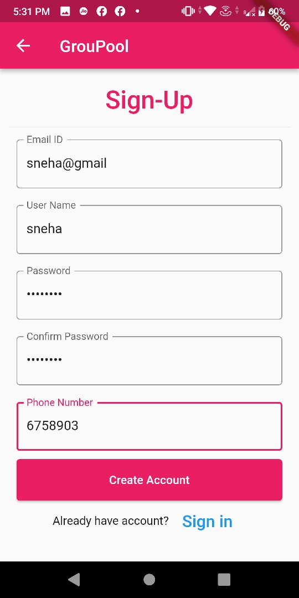
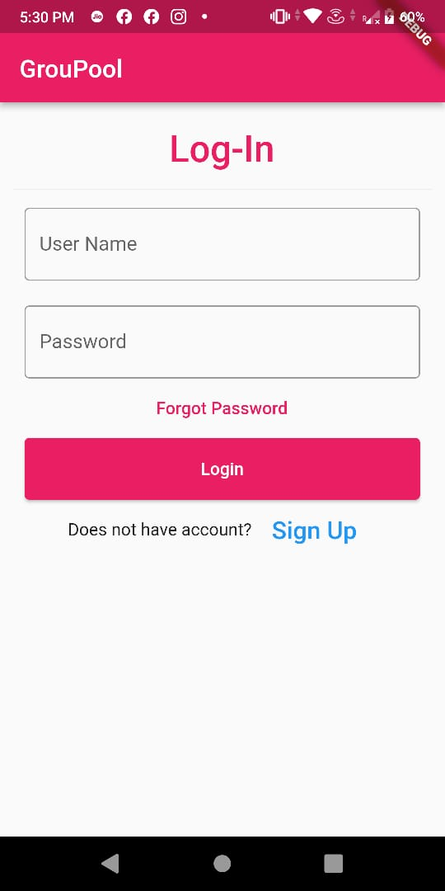
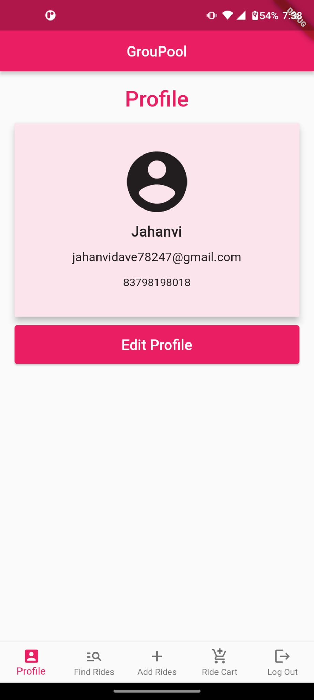
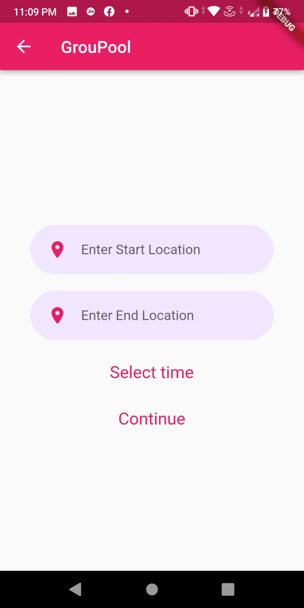
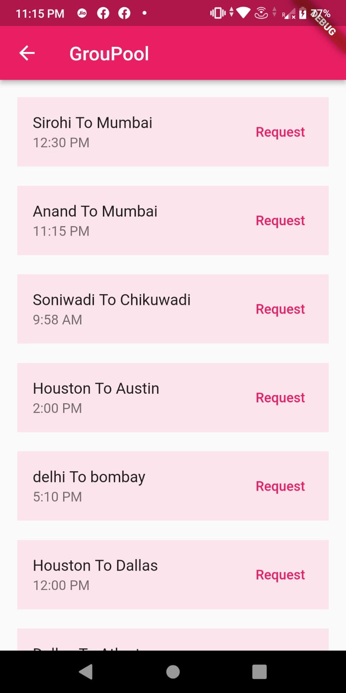

# GrouPool

## Description

This is a carpooling service, targetting people who commute to work or school everyday. The app is built using Flutter framework and the data is hosted on Firebase. This app allows users to carpool based on their source location and destination location. 

## Features

* Create the user profile.

* Login and authentication

* view user profile.

* Create a new ride.

* View available rides.

## Authors

* Jahanvi Dave 
* Sneha Seenuvasavarathan
* Ruben Malvaez

## Resources for getting started with Flutter

A few resources to get you started if this is your first Flutter project:

- [Lab: Write your first Flutter app](https://flutter.dev/docs/get-started/codelab)
- [Cookbook: Useful Flutter samples](https://flutter.dev/docs/cookbook)

For help getting started with Flutter, view
[online documentation](https://flutter.dev/docs), which offers tutorials,
samples, guidance on mobile development, and a full API reference.

## References

* https://api.flutter.dev
* https://pub.dev/

